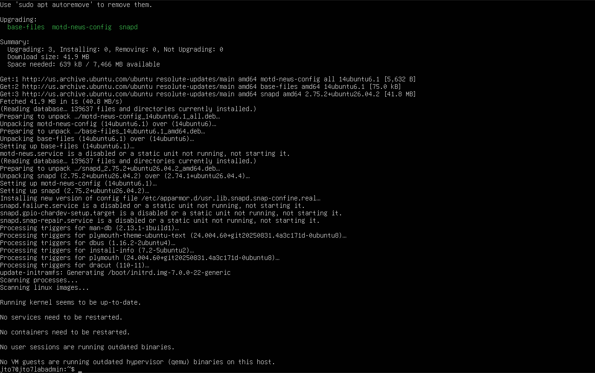
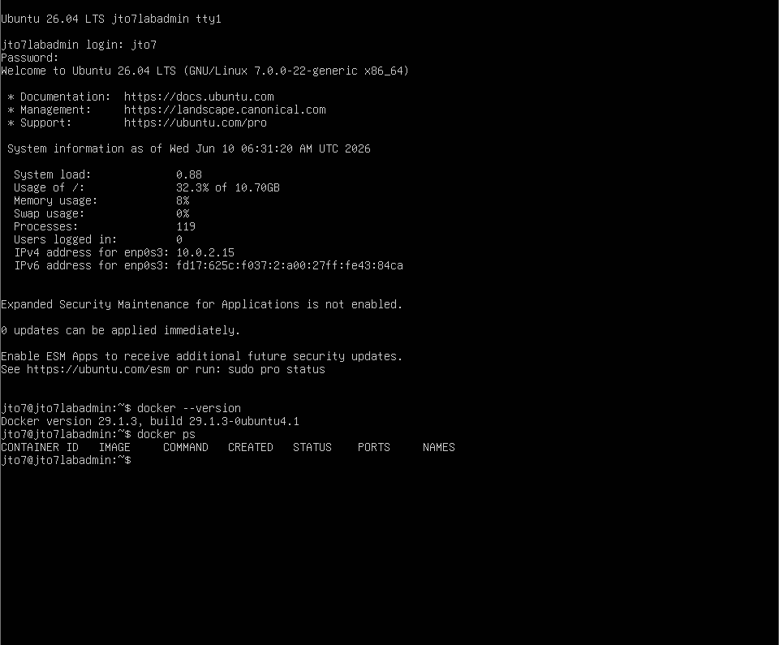
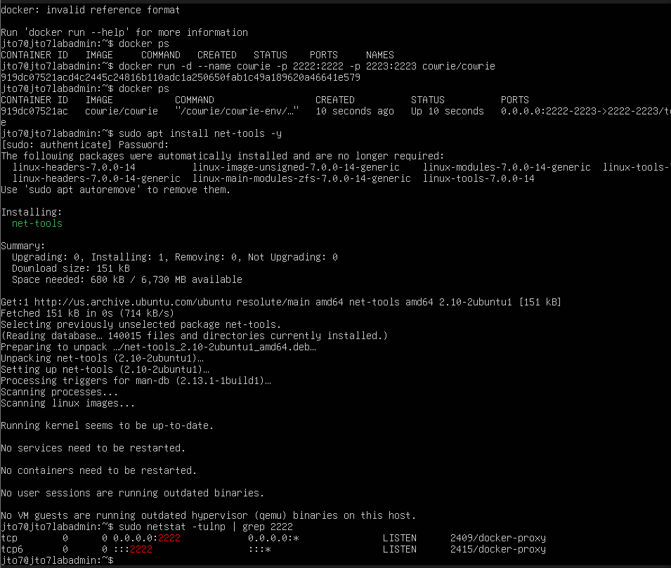
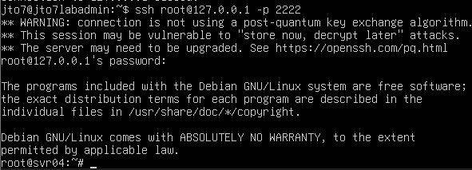
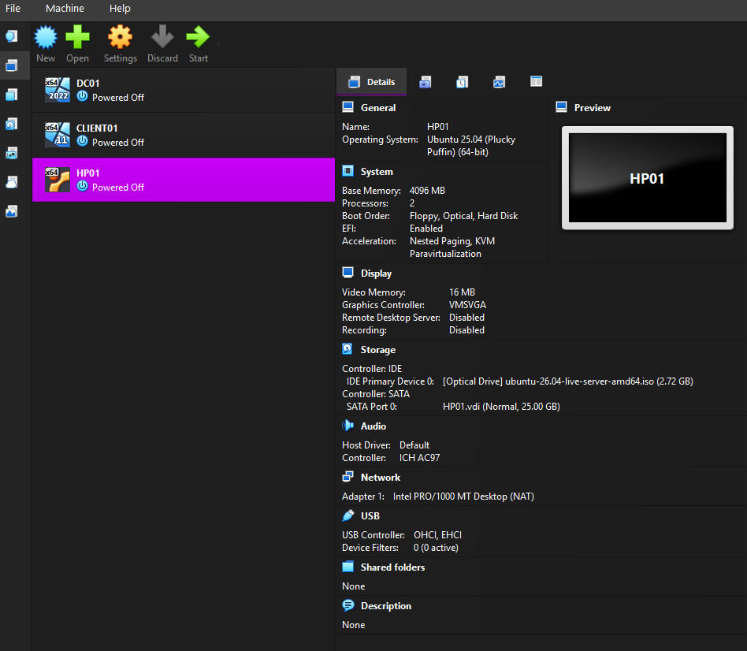

# Cowrie SSH Honeypot Lab

## Overview

This lab documents the setup and testing of a basic SSH honeypot using Cowrie inside an Ubuntu Server virtual machine.

Cowrie is an SSH/Telnet honeypot that is designed to capture login attempts, fake shell activity, and attacker behavior. In this lab, Cowrie was deployed in Docker and tested with controlled local SSH login attempts.

The purpose of this lab is to practice honeypot deployment, safe attacker-behavior simulation, Docker usage, SSH testing, and log review.

## Lab Objective

The goal of this lab was to deploy a safe local SSH honeypot and prove that it can capture attacker-style activity.

This lab demonstrates how to:

- Create an Ubuntu Server VM named `HP01`
- Install and verify Docker
- Pull the Cowrie Docker image
- Run Cowrie as a Docker container
- Expose Cowrie SSH on port `2222`
- Connect to the honeypot with a fake SSH login attempt
- Confirm Cowrie drops the user into a fake shell
- Review Cowrie logs to confirm login attempts and commands were captured

## Lab Environment

| Component | Value |
|---|---|
| Hypervisor | Oracle VirtualBox |
| Honeypot VM | HP01 |
| Operating System | Ubuntu Server |
| Honeypot Software | Cowrie |
| Deployment Method | Docker |
| Honeypot SSH Port | 2222 |
| Test Username | root |
| Test Password | Fake lab password |
| Exposure Type | Local lab testing only |

## Requirements

See [`REQUIREMENTS.md`](REQUIREMENTS.md) for full hardware, software, and safety requirements.

## Project Structure

```text
01-cowrie-ssh-honeypot/
├── README.md
├── REQUIREMENTS.md
├── requirements.txt
└── screenshots/
    ├── 01-ubuntu-server-vm-created.png
    ├── 02-docker-installed.png
    ├── 03-cowrie-image-pulled.png
    ├── 04-cowrie-container-running.png
    ├── 05-honeypot-port-listening.png
    ├── 06-test-ssh-login-fake-shell.png
    ├── 07-cowrie-captured-login-event.png
    └── 08-cowrie-captured-commands.png
```

## Important Safety Note

This lab was performed in a controlled local environment.

The honeypot was not used to attack anyone, retaliate, or scan outside systems. The SSH login activity was generated manually for testing.

A honeypot should be used for observation and logging, not revenge or unauthorized activity.

## Step 1: Create the Ubuntu Server VM

A new Ubuntu Server virtual machine was created in VirtualBox and named `HP01`.

Recommended VM settings:

```text
Name: HP01
OS Type: Linux
OS Distribution: Ubuntu
RAM: 2048 MB minimum
CPU: 2
Disk: 25 GB minimum
Network: NAT for safe local testing
```



Using NAT keeps the honeypot safer for the first version of the lab because it avoids exposing the VM directly to the local network or internet.

## Step 2: Install and Verify Docker

After Ubuntu Server was installed, Docker was installed and verified.

Commands used:

```bash
sudo apt update
sudo apt install docker.io -y
sudo systemctl enable docker
sudo systemctl start docker
docker --version
docker ps
```


Docker is used to run Cowrie without manually installing all Cowrie dependencies on the host VM.

## Step 3: Pull the Cowrie Docker Image

The Cowrie Docker image was downloaded.

Command used:

```bash
docker pull cowrie/cowrie
```



This downloads the latest Cowrie container image.

## Step 4: Run the Cowrie Container

Cowrie was started as a Docker container.

Command used:

```bash
docker run -d --name cowrie -p 2222:2222 -p 2223:2223 cowrie/cowrie
```

The container was then verified with:

```bash
docker ps
```



The `-p 2222:2222` option maps Cowrie's SSH honeypot service to port `2222` on the VM.

## Step 5: Verify the Honeypot Port

The listening port was checked to confirm that Cowrie was reachable.

Useful commands:

```bash
ss -tulnp | grep 2222
```

or:

```bash
sudo netstat -tulnp | grep 2222
```


This confirms that the honeypot SSH service is listening on port `2222`.

## Step 6: Test SSH Login to the Honeypot

A controlled SSH login attempt was made against Cowrie.

Command used:

```bash
ssh root@127.0.0.1 -p 2222
```

A fake password was entered.

Cowrie intentionally accepted the login and placed the session into a fake Linux shell.



This is expected behavior. Cowrie is pretending to be a vulnerable SSH server so it can record what the attacker does.

## Step 7: Review Captured Login Events

Cowrie logs were reviewed using Docker logs.

Command used:

```bash
docker logs cowrie
```

The logs showed the login attempt, username, password attempt, session activity, and connection details.



Example captured details include:

```text
Username tried: root
Password tried: fake lab password
Source IP: local Docker/host IP
Result: login captured by Cowrie
```

## Step 8: Capture Fake Shell Commands

Inside the fake Cowrie shell, test commands were entered, such as:

```bash
whoami
id
uname -a
ls
cat /etc/passwd
exit
```

The commands were then reviewed in the Cowrie logs.


This proves Cowrie captured attacker-style command activity after login.

## What I Learned

Through this lab, I learned how a basic SSH honeypot works and how Cowrie can be used to safely capture login attempts and fake shell activity.

I also learned that Cowrie intentionally accepts some fake logins so it can observe what a user does inside a controlled fake environment. This does not mean the real Ubuntu server was compromised. The attacker is interacting with Cowrie's simulated shell, not the actual host system.

This lab also reinforced the value of logs. The most important proof is not just that the container runs, but that the honeypot records authentication attempts and commands.

## Troubleshooting Notes

| Problem | Likely Cause | Fix |
|---|---|---|
| `docker: command not found` | Docker is not installed | Install Docker with `sudo apt install docker.io -y` |
| Cowrie container does not start | Bad Docker command syntax | Run the Cowrie command as one line |
| `docker ps` shows nothing | Container is stopped | Run `docker ps -a` and check logs |
| SSH connects to the real server instead of Cowrie | Wrong port used | Use `ssh root@127.0.0.1 -p 2222` |
| `docker exec` shell fails | Cowrie container is minimal | Use `docker logs cowrie` instead |
| No commands appear in logs | No commands were typed in fake shell | Log in again, type test commands, then check logs |

## Future Improvements

Possible improvements for this lab include:

- Save Cowrie logs to a mounted host folder
- Parse Cowrie logs with Python
- Create a second lab for Cowrie log analysis
- Build a dashboard with Grafana, ELK, or Splunk Free
- Deploy the honeypot to a cloud VPS with stricter firewall rules
- Add firewall restrictions around management access
- Compare local test traffic vs real internet noise
- Document top usernames, passwords, source IPs, and commands

## Security and Ethics Notice

This lab was created for educational use in a private lab environment.

Do not expose honeypots from a home network unless you understand firewalling, segmentation, logging, and risk. Do not store real files, passwords, SSH keys, or sensitive information on a honeypot.

Only test systems that you own or have explicit permission to use. Do not retaliate against source IPs, scan attackers, or perform unauthorized activity.
