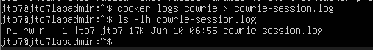
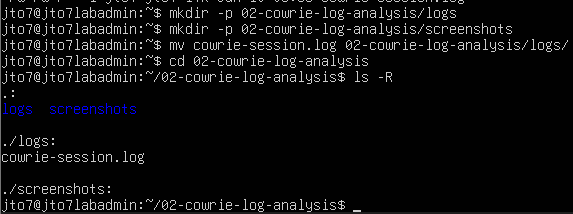
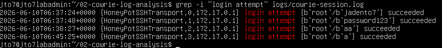
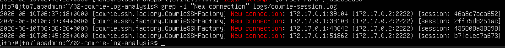
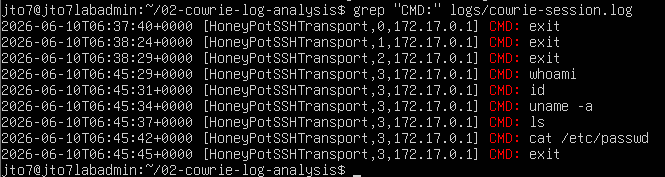
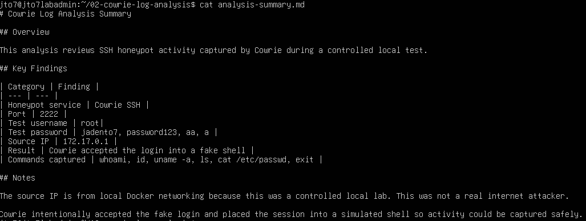

# Cowrie Log Analysis Lab

## Overview

This lab documents basic analysis of Cowrie SSH honeypot logs from a controlled local test.

The previous lab deployed Cowrie as an SSH honeypot. This lab focuses on reviewing the collected logs and extracting useful security information such as login attempts, attempted credentials, source connection information, and commands typed in the fake shell.

The goal is to move beyond simply running a honeypot and show that the captured activity can be reviewed and summarized.

## Lab Objective

This lab demonstrates how to:

- Export Cowrie Docker logs to a file
- Organize logs into a GitHub-ready project structure
- Search logs for SSH login attempts
- Identify attempted usernames and passwords
- Review source connection information
- Extract commands typed in the fake Cowrie shell
- Create a short analysis summary
- Document findings clearly and honestly

## Lab Environment

| Component | Value |
|---|---|
| Honeypot | Cowrie |
| Deployment Method | Docker |
| VM | HP01 |
| OS | Ubuntu Server |
| Honeypot SSH Port | 2222 |
| Test Username | root |
| Test Password | aa |
| Source IP Observed | 172.17.0.1 |
| Log Source | Docker logs |
| Analysis Type | Controlled local test |

## Requirements

See [`REQUIREMENTS.md`](REQUIREMENTS.md) for the full requirements.

## Project Structure

```text
02-cowrie-log-analysis/
├── README.md
├── REQUIREMENTS.md
├── requirements.txt
├── analysis-summary.md
├── logs/
│   └── README.md
└── screenshots/
    ├── 01-cowrie-logs-exported.png
    ├── 02-log-file-created.png
    ├── 03-login-events-found.png
    ├── 04-usernames-and-passwords-analyzed.png
    ├── 05-source-ips-analyzed.png
    ├── 06-commands-analyzed.png
    └── 07-final-analysis-summary.png
```

## Important Note About Local Testing

This lab was performed locally. The observed source IP `172.17.0.1` is associated with local Docker networking, not a real external attacker.

That matters because the README should not exaggerate the results. This lab demonstrates local Cowrie log analysis, not real-world threat intelligence collection.

## Step 1: Export Cowrie Logs

Cowrie logs were exported from the Docker container into a local file.

Command used:

```bash
docker logs cowrie > cowrie-session.log
ls -lh cowrie-session.log
```



The `ls -lh` output confirmed that the `cowrie-session.log` file was created and contained data.

## Step 2: Create the Project Folder Structure

A project folder was created for the log analysis lab.

Commands used:

```bash
mkdir -p 02-cowrie-log-analysis/logs
mkdir -p 02-cowrie-log-analysis/screenshots
mv cowrie-session.log 02-cowrie-log-analysis/logs/
cd 02-cowrie-log-analysis
ls -R
```



This organized the exported log file into a `logs/` directory for analysis.

## Step 3: Identify Login Events

The log file was searched for authentication activity.

Command used:

```bash
grep -i "login attempt" logs/cowrie-session.log
```



This confirmed that Cowrie captured at least one SSH login attempt.

## Step 4: Analyze Usernames and Passwords

The login attempt output was reviewed to identify the username and password used during the controlled test.

Example finding:

```text
Username: root
Password: aa
Result: succeeded inside Cowrie fake shell
```



Cowrie intentionally accepted the fake login so it could place the session into a simulated shell and record activity.

## Step 5: Analyze Source Connections

The logs were reviewed for new SSH connection information.

Useful command:

```bash
grep -i "New connection" logs/cowrie-session.log
```


The observed source IP was local to the Docker/host networking environment. Because this was a local lab, the source IP should not be described as a real internet attacker.

## Step 6: Analyze Captured Commands

The Cowrie logs were searched for commands typed in the fake shell.

Command used:

```bash
grep "CMD:" logs/cowrie-session.log
```



The captured command activity showed what was typed during the simulated SSH session.

## Step 7: Create the Final Analysis Summary

A short Markdown summary was created to document the key findings from the log review.

File created:

```text
analysis-summary.md
```



The summary includes the honeypot service, test port, username, password, source IP, result, and commands captured.

## Key Findings

| Category | Finding |
|---|---|
| Honeypot service | Cowrie SSH |
| SSH port | 2222 |
| Username attempted | root |
| Password attempted | aa |
| Source IP | 172.17.0.1 |
| Session result | Cowrie accepted the login into a fake shell |
| Commands captured | exit |

## What I Learned

Through this lab, I learned how to export and review Cowrie honeypot logs. The most important lesson was that running a honeypot is only the first step. The value comes from analyzing the captured activity.

I also learned that local test data must be described accurately. Since this lab was run locally, the source IP represents Docker networking, not a real attacker on the internet.

This lab reinforced basic log analysis skills using common Linux tools such as:

```bash
grep
wc
ls
cat
```

## Troubleshooting Notes

| Problem | Likely Cause | Fix |
|---|---|---|
| `cowrie-session.log` is empty | Cowrie has not captured activity yet | Perform a test SSH login first |
| `grep` shows no login attempts | Search phrase does not exist in logs | Try `grep -i "login" logs/cowrie-session.log` |
| `wc-1` command fails | Missing space and wrong character | Use `wc -l` with a lowercase L |
| Source IP looks strange | Docker bridge networking | Document it as local Docker networking |
| Only `exit` appears under commands | No other commands were typed | Run another fake shell session and type more commands |
| Raw logs are messy | Docker logs include debug output | Extract only relevant lines into separate files |

## Future Improvements

Possible improvements for this lab include:

- Extract login attempts into `login-attempts.txt`
- Extract commands into `commands.txt`
- Count top usernames and passwords
- Parse Cowrie JSON logs if available
- Write a Python script to summarize Cowrie activity
- Build a dashboard using Grafana, ELK, or Splunk Free
- Deploy Cowrie to a cloud VPS and compare local test data with real internet noise
- Add charts for usernames, passwords, source IPs, and commands

## Security and Ethics Notice

This lab was created for educational use in a controlled local environment.

Do not publish sensitive logs without reviewing them first. Honeypot logs may contain IP addresses, attempted passwords, usernames, and other information that should be handled carefully.

Do not retaliate against source IPs, scan attackers, or perform unauthorized activity. Honeypots are for observation, learning, and defensive analysis.
