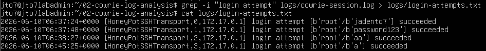
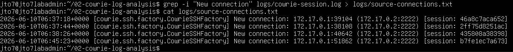
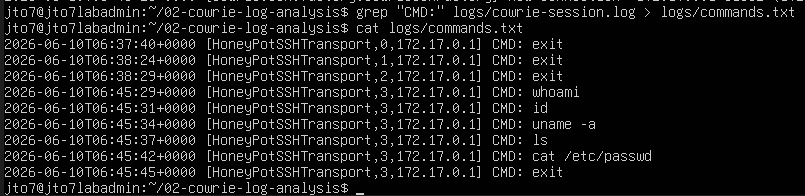
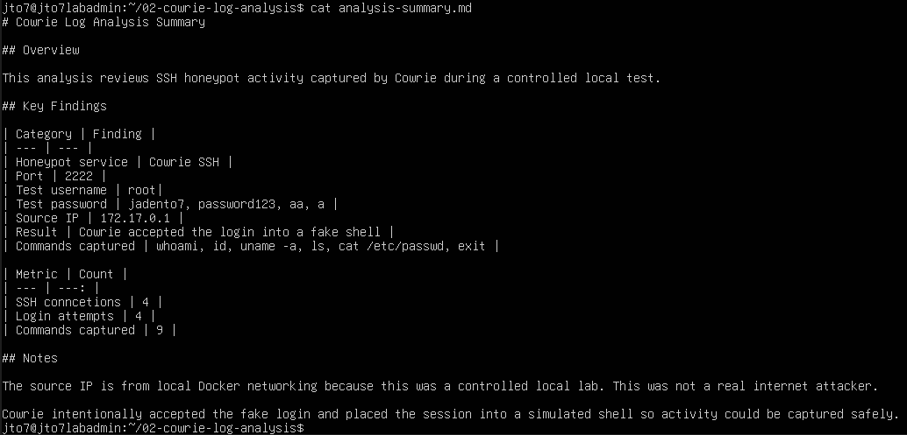

# Cowrie Log Analysis Lab

## Overview

This lab analyzes SSH honeypot activity captured by Cowrie during a controlled local test.

The previous lab deployed a Cowrie SSH honeypot in Docker. This lab focuses on reviewing the captured logs and extracting useful security information such as login attempts, attempted credentials, source connection information, commands typed in the fake shell, and basic activity counts.

This lab does **not** claim to show real internet attacker activity. The testing was performed locally, and the observed source IP address comes from Docker networking.

## Lab Objective

The goal of this lab was to prove that Cowrie logs can be exported, searched, filtered, and summarized.

This lab demonstrates how to:

- Export Cowrie Docker logs to a file
- Organize log files into a project folder
- Extract login attempts from Cowrie logs
- Save filtered login events into separate text files
- Identify attempted usernames and passwords
- Identify source connection information
- Extract commands typed inside the fake Cowrie shell
- Create a Markdown analysis summary
- Add basic metrics and counts to the final summary

## Lab Environment

| Component | Value |
|---|---|
| Honeypot | Cowrie SSH |
| Deployment Method | Docker |
| VM | HP01 |
| OS | Ubuntu Server |
| Honeypot SSH Port | 2222 |
| Test Username | root |
| Source IP Observed | 172.17.0.1 |
| Log Source | `docker logs cowrie` |
| Analysis Type | Controlled local test |

## Requirements

See [`REQUIREMENTS.md`](REQUIREMENTS.md) for full requirements.

## Project Structure

```text
02-cowrie-log-analysis/
├── README.md
├── REQUIREMENTS.md
├── requirements.txt
├── analysis-summary.md
├── logs/
│   ├── cowrie-session.log
│   ├── login-attempts.txt
│   ├── source-connections.txt
│   └── commands.txt
└── screenshots/
    ├── 01-cowrie-logs-exported.png
    ├── 02-log-file-created.png
    ├── 03-login-events-found.png
    ├── 03-login-events-found-saved.png
    ├── 04-usernames-and-passwords-analyzed.png
    ├── 04-usernames-and-passwords-analyzed-saved.png
    ├── 06-commands-analyzed.png
    ├── 06-commands-analyzed-saved.png
    ├── 07-final-analysis-summary.png
    └── 07-final-analysis-summary-with-counts.png
```

> Note: There is no `05-source-ips-analyzed.png` screenshot in this version because the source connection proof was captured through the saved source connection output during the workflow. The README avoids referencing a missing screenshot.

## Important Note About Local Docker Networking

The source IP observed in this lab was:

```text
172.17.0.1
```

This is related to local Docker networking in the lab environment. It should not be described as a real external attacker IP.

The correct interpretation is:

```text
Cowrie captured controlled local SSH test activity through Docker networking.
```

## Step 1: Export Cowrie Logs

Cowrie logs were exported from the running Docker container into a local log file.

Command used:

```bash
docker logs cowrie > cowrie-session.log
ls -lh cowrie-session.log
```


The exported log file was created successfully and contained log data.

## Step 2: Create the Log Analysis Folder Structure

A new project folder was created for the analysis lab.

Commands used:

```bash
mkdir -p 02-cowrie-log-analysis/logs
mkdir -p 02-cowrie-log-analysis/screenshots
mv cowrie-session.log 02-cowrie-log-analysis/logs/
cd 02-cowrie-log-analysis
ls -R
```


The output confirms that the project contains a `logs/` directory, a `screenshots/` directory, and the exported Cowrie log file.

## Step 3: Find Login Events

The Cowrie log file was searched for SSH login attempt events.

Command used:

```bash
grep -i "login attempt" logs/cowrie-session.log
```


The output shows multiple login attempts captured by Cowrie.

The results were also saved into a separate file:

```bash
grep -i "login attempt" logs/cowrie-session.log > logs/login-attempts.txt
cat logs/login-attempts.txt
```



This makes the analysis cleaner because the filtered login attempts can be reviewed separately from the full raw log.

## Step 4: Analyze Usernames and Passwords

The login attempt lines show the attempted username and passwords used during the controlled test.

Observed test username:

```text
root
```

Observed test password values:

```text
jadento7
password123
aa
a
```


The filtered login attempts were also saved and displayed from `logs/login-attempts.txt`.



Cowrie intentionally accepted these login attempts into a fake shell. This does not mean the real Ubuntu host was compromised.

## Step 5: Analyze Source Connections

The log file was searched for new SSH connection events.

Command used:

```bash
grep -i "New connection" logs/cowrie-session.log
```

The source connection output showed local Docker networking activity from:

```text
172.17.0.1
```

Example command for saving source connection data:

```bash
grep -i "New connection" logs/cowrie-session.log > logs/source-connections.txt
cat logs/source-connections.txt
```

Because this was a local lab, this IP should be documented as a local Docker/host-side address, not as a real public attacker.

## Step 6: Analyze Captured Commands

Cowrie logs were searched for commands typed inside the fake shell.

Command used:

```bash
grep "CMD:" logs/cowrie-session.log
```


Captured command activity included:

```text
exit
whoami
id
uname -a
ls
cat /etc/passwd
```

The command output was also saved into a separate file:

```bash
grep "CMD:" logs/cowrie-session.log > logs/commands.txt
cat logs/commands.txt
```



This is the strongest evidence in the lab because it proves Cowrie captured post-login fake shell activity.

## Step 7: Create the Analysis Summary

A Markdown summary file was created to document the key findings.

File created:

```text
analysis-summary.md
```


A second version of the summary included basic metrics and counts.



## Key Findings

| Category | Finding |
|---|---|
| Honeypot service | Cowrie SSH |
| Port | 2222 |
| Test username | root |
| Test passwords | jadento7, password123, aa, a |
| Source IP | 172.17.0.1 |
| Result | Cowrie accepted the login into a fake shell |
| Commands captured | whoami, id, uname -a, ls, cat /etc/passwd, exit |

## Metrics

| Metric | Count |
|---|---:|
| SSH connections | 4 |
| Login attempts | 4 |
| Commands captured | 9 |

## Analysis

The Cowrie logs show that SSH login attempts were captured using the username `root` and several fake test passwords. Cowrie intentionally accepted the login attempts and placed the sessions into a simulated shell.

The source IP `172.17.0.1` was generated by local Docker networking in this controlled lab. This should not be treated as a real external attacker.

The captured command activity shows that Cowrie recorded commands typed inside the fake shell, including basic Linux reconnaissance-style commands such as `whoami`, `id`, `uname -a`, `ls`, and `cat /etc/passwd`.

## What I Learned

Through this lab, I learned how to export Cowrie logs and analyze them with basic Linux command-line tools. I practiced using `grep` to filter relevant events and saving those results into separate analysis files.

The biggest lesson from this lab is that running a honeypot is only the first step. The real value comes from reviewing the captured activity and turning raw logs into useful findings.

I also learned that local test data must be described accurately. Since this lab was performed locally, the source IP represents Docker networking rather than a real internet attacker.

## Troubleshooting Notes

| Problem | Likely Cause | Fix |
|---|---|---|
| `cowrie-session.log` is empty | Cowrie has not captured activity yet | Perform a test SSH login first |
| `grep` returns nothing | Search phrase does not exist in the logs | Try broader searches like `grep -i "login"` |
| `wc-1` fails | Missing space and wrong character | Use `wc -l` with a space and lowercase L |
| Source IP looks unusual | Docker bridge networking | Document it as local Docker networking |
| Only `exit` appears in command logs | No other commands were typed | Log in again and type test commands |
| Raw logs are messy | Docker logs include debug output | Save filtered results into smaller text files |

## Future Improvements

Possible improvements for this lab include:

- Add the actual filtered `.txt` files to the repository
- Parse Cowrie JSON logs if available
- Write a Python script to summarize usernames, passwords, IPs, and commands
- Create charts for top attempted usernames and passwords
- Build a dashboard with Grafana, ELK, or Splunk Free
- Deploy Cowrie in a cloud VPS with strict isolation
- Compare local test activity against real internet honeypot activity

## Security and Ethics Notice

This lab was created for educational use in a controlled local environment.

Do not publish sensitive logs without reviewing them first. Honeypot logs may contain IP addresses, attempted passwords, usernames, and other information that should be handled carefully.

Do not retaliate against source IPs, scan attackers, or perform unauthorized activity. Honeypots are for observation, learning, and defensive analysis.
